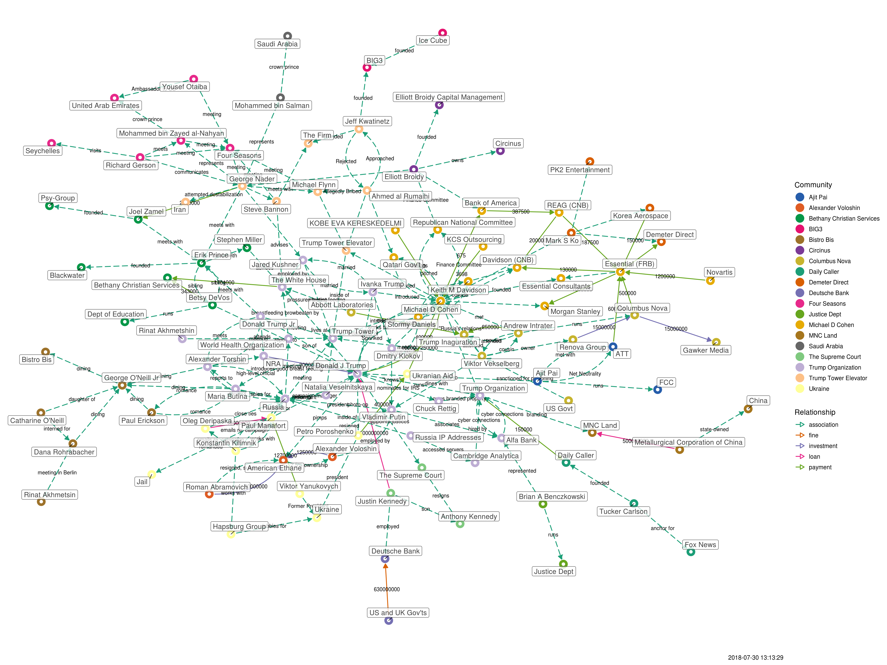

Initially, an attempt to visualize the Michael D Cohen / Essential Consulting financial data released by Michael Avenatti in the [Executive Summary](./Executive Summary.pdf), but has since grown to include various news reports. At one time, it included a link all the way to Kevin Bacon, but that was getting silly.

The source of the visual is on a [Google spreadsheet](https://docs.google.com/spreadsheets/d/119L80r1ZVgBgN0qDI-ovMb6s40iVFg3TWW15uqsxfBk/edit?usp=sharing) which you are invited to contribute to. The main rule is that it has to link through Cohen somehow, which isn't too hard to do.

The source code is on [Github](https://github.com/schnee/tangled) - if you clone that repo, you can run the tangled.R file and generate your own copy of the visuals.

A static visual is [available](./tangled.png), as is a [d3.js](./tangled-d3.html) version.

