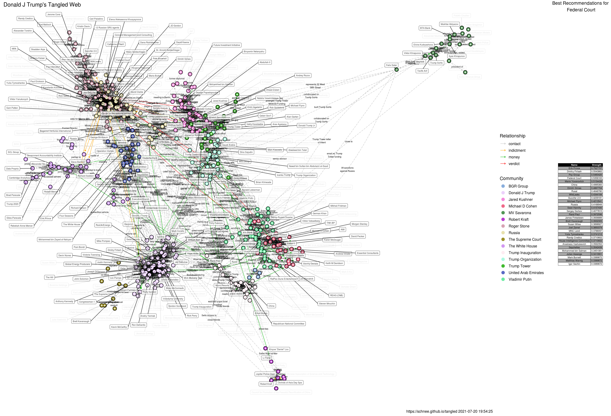

Initially, an attempt to visualize the Michael D Cohen / Essential Consulting financial data released by Michael Avenatti in the [Executive Summary](./Executive Summary.pdf), but has since grown to include various news reports. At one time, it included a link all the way to Kevin Bacon, but that was getting silly. Now, it mostly serves to help provide context (to me, at least) to the various news reports. "What is Alfa Bank?" - I can look at the visual and get an idea how that node connects to the rest.

The source of the visual is on a [data.world workspace](https://data.world/schnee/tangledweb) and a [Google spreadsheet](https://docs.google.com/spreadsheets/d/119L80r1ZVgBgN0qDI-ovMb6s40iVFg3TWW15uqsxfBk/edit#gid=0) which you are invited to contribute to. You can also DM or give me an '@schnee' shout-out on Twitter if you have some links for me.

The main rule _was_ that it has to link through Cohen somehow, but that's no longer in force (see the Tucker Carlson branch for example). I sort of expect that everything will tie in through Cohen in the end. If you want to contribute to the project, going through the [tangled spreadsheet](https://docs.google.com/spreadsheets/d/119L80r1ZVgBgN0qDI-ovMb6s40iVFg3TWW15uqsxfBk/edit#gid=0) and checking dates would be awesome, as would ensuring consistency in edge directions. That is, keeping a consistent sense of "pleaded guilty" versus "convicted by jury", if that makes sense (it is important for group names).

The "group" membership is found by using simmulated annealing oh the network, and applying the ["spin glass"](http://arxiv.org/abs/cond-mat/0603718) algorithm. Group names are the name of the node in the group with the greatest [pagerank](http://infolab.stanford.edu/~backrub/google.html) over the whole network.

The source code is on [Github](https://github.com/schnee/tangled) - if you clone that repo, you can run the tangled.R file and generate your own copy of the visuals. The "tangle-it.sh" file attempts to automate the generation and publication of the file to the gh-pages branch, which is how you are likely reading this right now.

A static visual is [available](./tangled.png), as is a [d3.js](./tangled-d3.html) version. I welcome pull requests, especially ones that will allow me to annotate the d3 version. I would especially appreciate help in animating the growth and evolution of the network over time.

This work is licensed under a [Creative Commons Attribution 4.0 International License](http://creativecommons.org/licenses/by/4.0/)